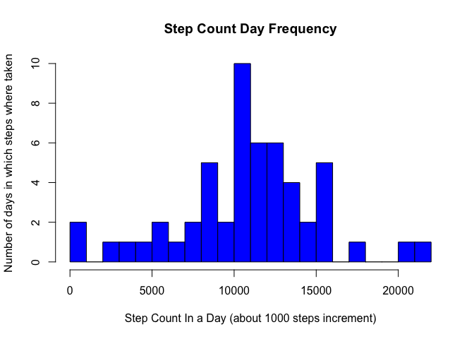
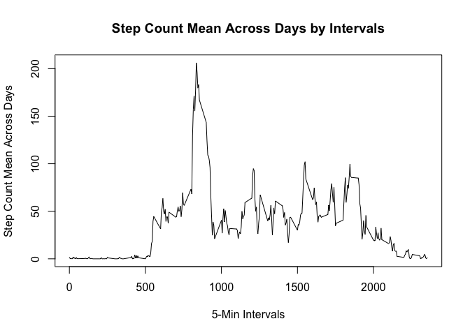
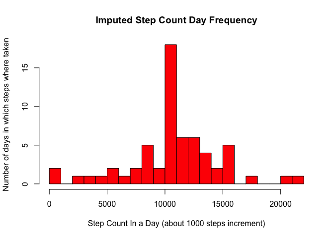
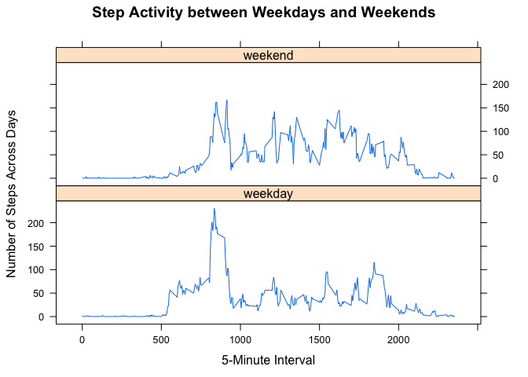

## Loading and preprocessing the data
1 - Load the data  


```r
knitr::opts_chunk$set(echo = TRUE)
# index.rmd must knit in project copied from git respository & data file referenced in same repo
steps <- read.csv("./activity.csv", header=TRUE)
```

## What is mean total number of steps taken per day?
1 - Make a histogram of the total number of steps taken each day  


```r
# since functions from both plyr and dplyr will be used, loading plyr before dplyr 
# plyr package has function ddply to input dataframe, exec functions and output df (very useful)
library(plyr)
library(dplyr)
# > pipe carries the group_by factor into summarize
stepsByDate <- data.frame(steps %>% group_by(date) %>% summarize(sumSteps <- sum(steps)))
colnames(stepsByDate) <- c("Date", "NumberOfSteps")
# create histogram
hist(stepsByDate$NumberOfSteps, breaks=20,
     xlab = "Step Count In a Day (about 1000 steps increment)",
     ylab = "Number of days in which steps where taken",
     main = "Step Count Day Frequency",
     col = 'blue'
)
```

<!-- -->

2 - Calculate and report the mean and median total number of steps taken per day  


```r
# get mean and median of step count by date
stepsMeanDF <- data.frame(steps %>% group_by(date) 
  %>% summarize(stepsMean <- mean(steps,na.rm=TRUE), stepsMedian <- median(steps,na.rm=TRUE)))
colnames(stepsMeanDF) <- c("Date", "Mean", "Median")
#View(stepsMeanDF)
```


```r
knitr::kable(stepsMeanDF, caption = "Step Mean and Median by Date") 
```


Table: Step Mean and Median by Date

Date                Mean   Median
-----------  -----------  -------
2012-10-01           NaN       NA
2012-10-02     0.4375000        0
2012-10-03    39.4166667        0
2012-10-04    42.0694444        0
2012-10-05    46.1597222        0
2012-10-06    53.5416667        0
2012-10-07    38.2465278        0
2012-10-08           NaN       NA
2012-10-09    44.4826389        0
2012-10-10    34.3750000        0
2012-10-11    35.7777778        0
2012-10-12    60.3541667        0
2012-10-13    43.1458333        0
2012-10-14    52.4236111        0
2012-10-15    35.2048611        0
2012-10-16    52.3750000        0
2012-10-17    46.7083333        0
2012-10-18    34.9166667        0
2012-10-19    41.0729167        0
2012-10-20    36.0937500        0
2012-10-21    30.6284722        0
2012-10-22    46.7361111        0
2012-10-23    30.9652778        0
2012-10-24    29.0104167        0
2012-10-25     8.6527778        0
2012-10-26    23.5347222        0
2012-10-27    35.1354167        0
2012-10-28    39.7847222        0
2012-10-29    17.4236111        0
2012-10-30    34.0937500        0
2012-10-31    53.5208333        0
2012-11-01           NaN       NA
2012-11-02    36.8055556        0
2012-11-03    36.7048611        0
2012-11-04           NaN       NA
2012-11-05    36.2465278        0
2012-11-06    28.9375000        0
2012-11-07    44.7326389        0
2012-11-08    11.1770833        0
2012-11-09           NaN       NA
2012-11-10           NaN       NA
2012-11-11    43.7777778        0
2012-11-12    37.3784722        0
2012-11-13    25.4722222        0
2012-11-14           NaN       NA
2012-11-15     0.1423611        0
2012-11-16    18.8923611        0
2012-11-17    49.7881944        0
2012-11-18    52.4652778        0
2012-11-19    30.6979167        0
2012-11-20    15.5277778        0
2012-11-21    44.3993056        0
2012-11-22    70.9270833        0
2012-11-23    73.5902778        0
2012-11-24    50.2708333        0
2012-11-25    41.0902778        0
2012-11-26    38.7569444        0
2012-11-27    47.3819444        0
2012-11-28    35.3576389        0
2012-11-29    24.4687500        0
2012-11-30           NaN       NA


## What is the average daily activity pattern?
1 - Make a time series plot of the 5-minute interval (x-axis) and the average number of steps taken, averaged across all days (y-axis)  


```r
#get average number of steps across all days
stepsMeanAcrossDaysDF <- data.frame(steps %>% group_by(interval) 
   %>% summarize(stepsMeanAcrossDays <- mean(steps, na.rm=TRUE)))
colnames(stepsMeanAcrossDaysDF) <- c("interval","stepsMeanAcrossDays")
#plot line graph
#  e.g., 200 average steps taken during time interval about 900
plot(stepsMeanAcrossDaysDF$interval,
     stepsMeanAcrossDaysDF$stepsMeanAcrossDays,
     ylab="Step Count Mean Across Days",
     xlab="5-Min Intervals",
     type="l",
     main="Step Count Mean Across Days by Intervals")
```

<!-- -->

2 - Which 5-minute interval, on average across all the days in the dataset, contains the maximum number of steps?

```r
stepsMeanAcrossDaysDF[stepsMeanAcrossDaysDF$stepsMeanAcrossDays==max(stepsMeanAcrossDaysDF$stepsMeanAcrossDays),]
```

```
##     interval stepsMeanAcrossDays
## 104      835            206.1698
```


## Imputing missing values
1 - Calculate and report the total number of missing values in the dataset (i.e. the total number of rows with NAs)


```r
summary(steps)
```

```
##      steps                date          interval     
##  Min.   :  0.00   2012-10-01:  288   Min.   :   0.0  
##  1st Qu.:  0.00   2012-10-02:  288   1st Qu.: 588.8  
##  Median :  0.00   2012-10-03:  288   Median :1177.5  
##  Mean   : 37.38   2012-10-04:  288   Mean   :1177.5  
##  3rd Qu.: 12.00   2012-10-05:  288   3rd Qu.:1766.2  
##  Max.   :806.00   2012-10-06:  288   Max.   :2355.0  
##  NA's   :2304     (Other)   :15840
```


==>  2304 is total number of NAs


2 - Devise a strategy for filling in all of the missing values in the dataset.


==>  Mean of steps for the 5-minute intervals across days is used to impute missing values  


3 - Create a new dataset that is equal to the original dataset but with the missing data filled in.  


```r
# create impute function
impute <- function(x) replace(x,is.na(x),mean(x,na.rm=TRUE))
# impute missing values 
stepsImputed<-ddply(steps,~interval,transform,steps=impute(steps))
```

4a - Make a histogram of the total number of steps taken each day  


```r
# > pipe carries the group_by factor into summarize
imputedStepsByDate <- data.frame(stepsImputed %>% group_by(date) %>% summarize(sumImputedSteps <- sum(steps)))
colnames(imputedStepsByDate) <- c("Date", "NumberOfSteps")
# create histogram
hist(imputedStepsByDate$NumberOfSteps, breaks=20,
     xlab = "Step Count In a Day (about 1000 steps increment)",
     ylab = "Number of days in which steps where taken",
     main = "Imputed Step Count Day Frequency",
     col = 'red'
)
```

<!-- -->

4b - Calculate and report the mean and median total number of steps taken per day. Do these values differ from the estimates from the first part of the assignment? What is the impact of imputing missing data on the estimates of the total daily number of steps?


==>  Yes estimates with imputed values show more than 18 days in which 10 to 11k steps were taken, compared to non-imputed estimates of 10 days. 

==>  Missing values could impact conclusion of the analysis


```r
# get mean and median of step count by date
imputedStepsMeanDF <- data.frame(stepsImputed %>% group_by(date) 
  %>% summarize(imputedStepsMean <- mean(steps,na.rm=TRUE), imputedStepsMedian <- median(steps,na.rm=TRUE)))
colnames(imputedStepsMeanDF) <- c("Date", "Mean", "Median")
```


```r
knitr::kable(imputedStepsMeanDF, caption = "Imputed Step Mean and Median by Date") 
```


Table: Imputed Step Mean and Median by Date

Date                Mean     Median
-----------  -----------  ---------
2012-10-01    37.3825996   34.11321
2012-10-02     0.4375000    0.00000
2012-10-03    39.4166667    0.00000
2012-10-04    42.0694444    0.00000
2012-10-05    46.1597222    0.00000
2012-10-06    53.5416667    0.00000
2012-10-07    38.2465278    0.00000
2012-10-08    37.3825996   34.11321
2012-10-09    44.4826389    0.00000
2012-10-10    34.3750000    0.00000
2012-10-11    35.7777778    0.00000
2012-10-12    60.3541667    0.00000
2012-10-13    43.1458333    0.00000
2012-10-14    52.4236111    0.00000
2012-10-15    35.2048611    0.00000
2012-10-16    52.3750000    0.00000
2012-10-17    46.7083333    0.00000
2012-10-18    34.9166667    0.00000
2012-10-19    41.0729167    0.00000
2012-10-20    36.0937500    0.00000
2012-10-21    30.6284722    0.00000
2012-10-22    46.7361111    0.00000
2012-10-23    30.9652778    0.00000
2012-10-24    29.0104167    0.00000
2012-10-25     8.6527778    0.00000
2012-10-26    23.5347222    0.00000
2012-10-27    35.1354167    0.00000
2012-10-28    39.7847222    0.00000
2012-10-29    17.4236111    0.00000
2012-10-30    34.0937500    0.00000
2012-10-31    53.5208333    0.00000
2012-11-01    37.3825996   34.11321
2012-11-02    36.8055556    0.00000
2012-11-03    36.7048611    0.00000
2012-11-04    37.3825996   34.11321
2012-11-05    36.2465278    0.00000
2012-11-06    28.9375000    0.00000
2012-11-07    44.7326389    0.00000
2012-11-08    11.1770833    0.00000
2012-11-09    37.3825996   34.11321
2012-11-10    37.3825996   34.11321
2012-11-11    43.7777778    0.00000
2012-11-12    37.3784722    0.00000
2012-11-13    25.4722222    0.00000
2012-11-14    37.3825996   34.11321
2012-11-15     0.1423611    0.00000
2012-11-16    18.8923611    0.00000
2012-11-17    49.7881944    0.00000
2012-11-18    52.4652778    0.00000
2012-11-19    30.6979167    0.00000
2012-11-20    15.5277778    0.00000
2012-11-21    44.3993056    0.00000
2012-11-22    70.9270833    0.00000
2012-11-23    73.5902778    0.00000
2012-11-24    50.2708333    0.00000
2012-11-25    41.0902778    0.00000
2012-11-26    38.7569444    0.00000
2012-11-27    47.3819444    0.00000
2012-11-28    35.3576389    0.00000
2012-11-29    24.4687500    0.00000
2012-11-30    37.3825996   34.11321


## Are there differences in activity patterns between weekdays and weekends?
==>  There are differences between weekdays and weekends - steps appear to be taken at various time throughout the day on weekends as compared to weekdays.


1 - Create a new factor variable in the dataset with two levels -- "weekday" and "weekend" indicating whether a given date is a weekday or weekend day.


```r
# create dayType based weekdays()
stepsImputed$dayType <- ifelse(weekdays(as.Date(stepsImputed$date)) == "Saturday" | 
            weekdays(as.Date(stepsImputed$date)) == "Sunday", "weekend", "weekday")
# get average number of steps across all days
stepsImputedMeanAcrossDaysDF <- data.frame(stepsImputed %>% group_by(dayType, interval) 
      %>% summarize(stepsImputedMeanAcrossDays <- mean(steps, na.rm=TRUE)))
colnames(stepsImputedMeanAcrossDaysDF) <- c("dayType", "interval","stepsImputedMeanAcrossDays")
```

2 - Make a panel plot containing a time series plot of the 5-minute interval (x-axis) and the average number of steps taken, averaged across all weekday days or weekend days (y-axis).


```r
#use lattice system to plot
library(lattice)
xyplot(stepsImputedMeanAcrossDays ~ interval | dayType, 
       data = stepsImputedMeanAcrossDaysDF, layout = c(1,2), type = "l",
       main = "Step Activity between Weekdays and Weekends",
       xlab = "5-Minute Interval",
       ylab = "Number of Steps Across Days"
)
```

<!-- -->
